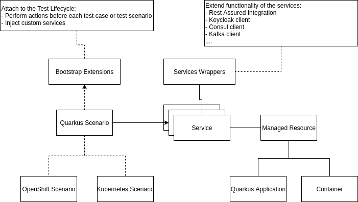

# Quarkus QE Test Framework

The framework is designed using Extension Model architecture patterns, so supporting additional features or deployment options like Kubernetes or AWS is just a matter of implementing extension points and providing the new Maven module in the classpath.



Main features:
- Easily deploy multiple Quarkus applications and third party components in a single test
- Write the test case once and run it everywhere (cloud, bare metal, etc)
- Developer and Test friendly
- Quarkus features focused (allow to define custom source classes, build/runtime properties, etc)
- Test isolation: for example, in OpenShift or Kubernetes, tests will be executed in an ephemeral namespace 

This framework follows the Quarkus version convention, so we can selectively specify the Quarkus version via the arguments:
- `-Dquarkus.platform.version=1.13.0.Final`
- `-Dquarkus-plugin.version=1.13.0.Final`
- `-Dquarkus.platform.group-id=io.quarkus`
- `-Dquarkus.platform.artifact-id=quarkus-universe-bom`

## Getting Started

In order to write Quarkus application in your tests, you first need to add the core dependency in your `pom.xml` file;

```xml
<dependency>
	<groupId>io.quarkus.qe</groupId>
	<artifactId>quarkus-test-core</artifactId>
</dependency>
```

The framework aims to think on scenarios to verify. One scenario could include a few Quarkus instances and other container resources:

```java
@QuarkusScenario
public class PingPongResourceIT {

    @QuarkusApplication(classes = PingResource.class)
    static final RestService pingApp = new RestService();

    @QuarkusApplication(classes = PongResource.class)
    static final RestService pongApp = new RestService();

    // will include ping and pong resources
    @QuarkusApplication
    static final RestService pingPongApp = new RestService();

    // ...

}
```

As seen in the above example, everything is bounded to a Service object that will contain everything needed to interact with our resources.

### Native

The `@QuarkusScenario` annotation is also compatible with Native. This means that if we run our tests using Native build:

```
mvn clean verify -Dnative
```

The tests will be executed on Native either in bare metal, OpenShift or Kubernetes.

Note that the framework will use the generated artifacts from the Maven build goal, however if you're updating a build property or using custom sources for your Quarkus application, the framework will build the Native artifact by you. This is done at the Maven failsafe execution, so failsafe needs to have the Native properties to work propertly. For doing so, we basically need to propagate the properties this way:

```xml
<profile>
    <id>native</id>
    <build>
        <plugins>
            <plugin>
                <artifactId>maven-failsafe-plugin</artifactId>
                <executions>
                    <execution>
                        <configuration>
                            <systemProperties>
                                <native.image.path>${project.build.directory}/${project.build.finalName}-runner</native.image.path>
                                <quarkus.package.type>${quarkus.package.type}</quarkus.package.type>
                                <quarkus.native.container-build>${quarkus.native.container-build}</quarkus.native.container-build>
                                <quarkus.native.native-image-xmx>${quarkus.native.native-image-xmx}</quarkus.native.native-image-xmx>
                            </systemProperties>
                        </configuration>
                    </execution>
                </executions>
            </plugin>
        </plugins>
    </build>
    <properties>
        <quarkus.package.type>native</quarkus.package.type>
        <quarkus.native.container-build>true</quarkus.native.container-build>
        <quarkus.native.native-image-xmx>3g</quarkus.native.native-image-xmx>
    </properties>
</profile>
```

Finally, if one of your tests are incompatible on Native, you can skip them using the `@DisabledOnNative` annotation:

```java
@QuarkusScenario
@DisabledOnNative
public class OnlyOnJvmIT {
    @QuarkusApplication(ssl = true)
    static final RestService app = new RestService();

    // ...
}
```

### Disable Tests on a Concrete Quarkus version

```java
@QuarkusScenario
@DisabledOnQuarkusVersion(version = "1\\.13\\..*", reason = "https://github.com/quarkusio/quarkus/issues/XXX")
public class AuthzSecurityHttpsIT {
    
}
```

This test will not run if the quarkus version is `1.13.X`.

### Containers 

The framework also supports to deployment of third party components provided by docker. First, we need an additional module:

```xml
<dependency>
	<groupId>io.quarkus.qe</groupId>
	<artifactId>quarkus-test-containers</artifactId>
</dependency>
```

Now, we can deploy services via docker:

```java
@QuarkusScenario
public class GreetingResourceIT {

    private static final String CUSTOM_PROPERTY = "my.property";

    @Container(image = "quay.io/bitnami/consul:1.9.3", expectedLog = "Synced node info", port = 8500)
    static final DefaultService consul = new DefaultService();

    @QuarkusApplication
    static final RestService app = new RestService();

    // ...
}
```

#### Kafka Containers

Due to the complexity of Kafka deployments, there is a special implementation of containers for Kafka that we can use by adding the dependency:

```xml
<dependency>
    <groupId>io.quarkus.qe</groupId>
    <artifactId>quarkus-test-service-kafka</artifactId>
    <scope>test</scope>
</dependency>
```

And now, we can use the Kafka container in our test:

```java
@QuarkusScenario
public class StrimziKafkaWithoutRegistryMessagingIT {

    @KafkaContainer
    static final KafkaService kafka = new KafkaService();

    @QuarkusApplication
    static final RestService app = new RestService()
            .withProperty("kafka.bootstrap.servers", kafka::getBootstrapUrl);

    // ...
}
```

By default, the KafkaContainer will use the Strimzi implementation and Registry (with Apicurio):

```java
@QuarkusScenario
public class StrimziKafkaWithRegistryMessagingIT {

    @KafkaContainer(withRegistry = true)
    static final KafkaService kafka = new KafkaService();

    @QuarkusApplication
    static final RestService app = new RestService()
            .withProperties("strimzi-application.properties")
            .withProperty("kafka.bootstrap.servers", kafka::getBootstrapUrl)
            .withProperty("strimzi.registry.url", kafka::getRegistryUrl);

    // ...
}
```

We can also use a Confluent kafka container by doing:

```java
@KafkaContainer(vendor = KafkaVendor.CONFLUENT)
```

Note that this implemenation supports also registry, but not Kubernetes and OpenShift scenarios.

#### AMQ Containers

Similar to Kafka, we have a default implementation of an AMQ container (Artemis vendor):

```java
@QuarkusScenario
public class AmqIT {

    @AmqContainer
    static final AmqService amq = new AmqService();

    @QuarkusApplication
    static final RestService app = new RestService()
            .withProperty("quarkus.artemis.username", amq.getAmqUser())
            .withProperty("quarkus.artemis.password", amq.getAmqPassword())
            .withProperty("quarkus.artemis.url", amq::getUrl);
```

We can specify a different image by setting `@AmqContainer(image = XXX)`.
This container is compatible with OpenShift, but not with Kubernetes deployments.

#### Jaeger Containers

Required dependency

```xml
<dependency>
    <groupId>io.quarkus.qe</groupId>
    <artifactId>quarkus-test-service-jaeger</artifactId>
    <scope>test</scope>
</dependency>
```

Usage example:

```
@JaegerContainer
static final JaegerService jaeger = new JaegerService();

@QuarkusApplication
static final RestService app = new RestService().withProperty("quarkus.jaeger.endpoint", jaeger::getRestUrl);
```
This container is compatible with OpenShift, but not with Kubernetes deployments.

#### Use custom templates for Containers

Sometimes deploying a third party into OpenShift or Kubernetes involves some complex configuration that is not required when deploying it on bare metal. For these scenarios, we allow to provide a custom template via `test.properties`:

```
ts.consul.openshift.template=/yourtemplate.yaml
```

Similarly, when deploying into kubernetes, we have the property `ts.consul.kubernetes.template`.

| Note that this is only supported for OpenShift and Kubernetes. 
| And the custom template must contain ONLY ONE deployment config (for OpenShift) or ONE deployment (for kubernetes).

Moreover, if the service that is exposing the port we want to target is named differently to our service, we can provide the service name via:

```
ts.consul.openshift.service=consul-http-service
```

Same with Kubernetes `ts.consul.kubernetes.service`.

What about if we want to use the internal service as route (not the exposed route), we can set this behaviour by enabling the property `ts.<MY_SERVICE>.openshift.use-internal-service-as-url`:

```
ts.consul.openshift.use-internal-service-as-url=true
```

Same with Kubernetes `ts.consul.openshift.use-internal-service-as-url`. 

## Architecture

This framework is designed to follow **extension model** patterns. Therefore, we can extend any functionality just by adding other dependencies that extend the current functionality. As an example, Quarkus applications will be deployed locally, but if we add the OpenShift module. we can automatically deploy it in OpenShift/K8s just by adding the `@OpenShiftScenario`.

### Packages

The modules within the test framework must follow the next package convention:

- `io.quarkus.test.bootstrap` - manage the lifecycle of the tests
- `io.quarkus.test.bootstrap.inject` - services that are injectable at test method level
- `io.quarkus.test.configuration` - configuration facilities
- `io.quarkus.test.logging` - logging facilities and handlers
- `io.quarkus.test.scenarios` - scenarios that the module implement, eg: `@OpenShiftScenario`
- `io.quarkus.test.scenarios.annotations` - useful JUnit annotations to disable/enable scenarios
- `io.quarkus.test.services` - services that the module implement, eg: `@QuarkusApplication`, `@Container`
- `io.quarkus.test.services.<service-name>` - bindings to configure the `service-name` to be extended or supported
- `io.quarkus.test.utils` - more utilities

## Supported Deployment Environments

By default, the framework will run all the tests on bare metal (local machine). However, we can extend this functionality by adding other modules and annotating our tests.

### OpenShift

Requirements:
- OC CLI installed
- Be connected to an running OpenShift instance - `oc login ...`

Verified Environments:
- OCP 4.6+ 

Use this Maven dependency:

```xml
<dependency>
	<groupId>io.quarkus.qe</groupId>
	<artifactId>quarkus-test-openshift</artifactId>
</dependency>
```

And now, we can write also scenarios to be run in OpenShift by adding the `@OpenShiftScenario`.

#### Enable/Disable Project Deletion on Failures

By default, the framework will always delete the OpenShift project and, sometimes, it's useful to not delete 
the OpenShift project on failures to troubleshooting purposes. For disabling the deletion, we need to run the 
test using:

```
mvn clean verify -Dts.openshift.delete.project.after.all=false
```

#### Operators

The OpenShift scenarios support Operator based test cases. There are two ways to deal with Operators:

- Installing the Operators as part of the `OpenShiftScenario`:

```java
@OpenShiftScenario(
        operators = @Operator(name = "strimzi-kafka-operator")
)
public class StrimziOperatorKafkaWithoutRegistryMessagingIT {
    // We can now use the new Operator CRDs manually
}
```

- Installing and managing Custom Resource Definitions as services

First, we need to create our Custom Resource YAML file, for example, for Kafka:

```yaml
apiVersion: kafka.strimzi.io/v1beta2
kind: Kafka
metadata:
  name: kafka-instance
spec:
  ...
```

Now, we can create an OperatorService to load this YAML as part of an Operator installation:

```java
@OpenShiftScenario
public class OperatorExampleIT {

    @Operator(name = "my-operator", source = "...")
    static final OperatorService operator = new OperatorService().withCrd("kafka-instance", "/my-crd.yaml");

    @QuarkusApplication
    static final RestService app = new RestService();

    // ...
}
```

The framework will install the operator and load the YAML file by you.

Note that the framework will wait for the operator to be installed before loading the CRD yaml files, but will not wait for the CRDs to be ready. If you are working with CRDs that update conditions, then we can ease this for you by providing the custom resource definition:

```java
@Version("v1beta2")
@Group("kafka.strimzi.io")
@Kind("Kafka")
public class KafkaInstanceCustomResource
        extends CustomResource<CustomResourceSpec, CustomResourceStatus>
        implements Namespaced {
}
```

And then registering the CRD with this type:

```java
@OpenShiftScenario
public class OperatorExampleIT {

    @Operator(name = "my-operator", source = "...")
    static final OperatorService operator = new OperatorService().withCrd("kafka-instance", "/my-crd.yaml", KafkaInstanceCustomResource.class);

    @QuarkusApplication
    static final RestService app = new RestService();

    // ...
}
```

Now, the framework will wait for the operator to be installed and the custom resource named `kafka-instance` to be with a condition "Ready" as "True".

#### Deployment Strategies

- **(Default) Using Build**

This strategy will build the Quarkus app artifacts locally and push it into OpenShift to generate the image that will be deployed. 

Example:

```java
@OpenShiftScenario // or @OpenShiftScenario(deployment = OpenShiftDeploymentStrategy.Build)
public class OpenShiftPingPongResourceIT {
    @QuarkusApplication(classes = PingResource.class)
    static final RestService pingApp = new RestService();

    @Test
    public void shouldPingWorks() {
        pingApp.given().get("/ping").then().statusCode(HttpStatus.SC_OK).body(is("ping"));
        pingApp.given().get("/pong").then().statusCode(HttpStatus.SC_NOT_FOUND);
    }
}
```

- **OpenShift Extension**

This strategy will delegate the deployment into the Quarkus OpenShift extension, so it will trigger a Maven command to run it. 

Example:

```java
@OpenShiftScenario(deployment = OpenShiftDeploymentStrategy.UsingOpenShiftExtension)
public class OpenShiftPingPongResourceIT {
    // ...
}
```

In order to use this strategy, you need to add this Maven profile into the pom.xml:

```xml
<profile>
    <id>deploy-to-openshift-using-extension</id>
    <dependencies>
        <dependency>
            <groupId>io.quarkus</groupId>
            <artifactId>quarkus-openshift</artifactId>
        </dependency>
    </dependencies>
</profile>
```

| Important note: This strategy does not support custom sources to be selected, this means that the whole Maven module will be deployed. Therefore, if we have:

```java
@OpenShiftScenario(deployment = OpenShiftDeploymentStrategy.UsingOpenShiftExtension)
public class OpenShiftUsingExtensionPingPongResourceIT {
    @QuarkusApplication(classes = PingResource.class)
    static final RestService pingPongApp = new RestService();
    
    // ...
}
```

The test case will fail saying that this is not supported using the Using OpenShift strategy.

- **OpenShift Extension and Using Docker Build**

This is an extension of the `OpenShift Extension` previous deployment strategy. The only difference is that a Docker build strategy will be used:

```java
@OpenShiftScenario(deployment = OpenShiftDeploymentStrategy.UsingOpenShiftExtensionAndDockerBuildStrategy)
public class OpenShiftUsingExtensionPingPongResourceIT {
    @QuarkusApplication(classes = PingResource.class)
    static final RestService pingPongApp = new RestService();
    
    // ...
}
```

The same limitations as in `OpenShift Extension` strategy apply here too.

- **Container Registry**

This strategy will build the image locally and push it to an intermediary container registry (provided by a system property). Then, the image will be pulled from the container registry in OpenShift.

```java
@OpenShiftScenario(deployment = OpenShiftDeploymentStrategy.UsingContainerRegistry)
public class OpenShiftUsingExtensionPingPongResourceIT {
    // ...
}
```

When running these tests, the container registry must be supplied as a system property:

```
mvn clean verify -Dts.container.registry-url=quay.io/<your username>
```

These tests can be disabled if the above system property is not set using the `@DisabledIfNotContainerRegistry` annotation:

```java
@OpenShiftScenario(deployment = OpenShiftDeploymentStrategy.UsingContainerRegistry)
@DisabledIfNotContainerRegistry
public class OpenShiftUsingExtensionPingPongResourceIT {
    // ...
}
```

#### Interact with the OpenShift Client directly

We can inject the OpenShift client to interact with OpenShift. This can be useful to cope with more complex scenarios like scale up/down services.

```java
import io.quarkus.test.bootstrap.inject.OpenShiftClient;
import io.quarkus.test.scenarios.OpenShiftScenario;

@OpenShiftScenario
public class OpenShiftGreetingResourceIT extends GreetingResourceIT {
    @Test
    public void shouldInjectOpenShiftClient(OpenShiftClient client) {
        // ...
        client.scaleTo(app, 2);
    }
}
```

Another option is by injecting the client directly to the test class using the `@Inject` annotation:

```java
import io.quarkus.test.bootstrap.inject.OpenShiftClient;
import io.quarkus.test.scenarios.OpenShiftScenario;

@OpenShiftScenario
public class OpenShiftGreetingResourceIT extends GreetingResourceIT {

    @Inject
    static OpenShiftClient client;
    
    @Test
    public void shouldInjectOpenShiftClient() {
        // ...
        client.scaleTo(app, 2);
    }
}
```

| Note that the injection is only supported to static fields.

#### Enable/Disable OpenShift tests via system properties

We can selectively disable/enable OpenShift tests via system properties and using the `@EnabledIfOpenShiftScenarioPropertyIsTrue` annotation:

```java
@OpenShiftScenario
@EnabledIfOpenShiftScenarioPropertyIsTrue
public class OpenShiftUsingExtensionPingPongResourceIT {
    // ...
}
```

This test will be executed only if the system property `ts.openshift.scenario.enabled` is `true`.

### Kubernetes

Requirements:
- Kubectl CLI installed
- Be connected to a running Kubernetes instance
- Public container registry where to push/pull images

Verified Environments:
- Kind using LoadBalancer: https://kind.sigs.k8s.io/docs/user/loadbalancer/ (the framework will expose services using LoadBalancer. This is not configurable yet.)

Use this Maven dependency:

```xml
<dependency>
	<groupId>io.quarkus.qe</groupId>
	<artifactId>quarkus-test-kubernetes</artifactId>
</dependency>
```

And now, we can write also scenarios to be run in Kubernetes by adding the `@KubernetesScenario`:

```java
@KubernetesScenario
public class KubernetesPingPongResourceIT {
    @QuarkusApplication(classes = PingResource.class)
    static final RestService pingApp = new RestService();

    @Test
    public void shouldPingWorks() {
        pingApp.given().get("/ping").then().statusCode(HttpStatus.SC_OK).body(is("ping"));
        pingApp.given().get("/pong").then().statusCode(HttpStatus.SC_NOT_FOUND);
    }
}
```

#### Enable/Disable Namespace Deletion on Failures

By default, the framework will always delete the Kubernetes namespace and, sometimes, it's useful to not delete 
the Kubernetes namespace on failures to troubleshooting purposes. For disabling the deletion on failures, we need to run the 
test using:

```
mvn clean verify -Dts.kubernetes.delete.namespace.after.all=false
```

#### Deployment Strategies

- **(Default) Container Registry** 

Kubernetes needs a container registry where to push and pull images, so we need to provide a property like:

```
mvn clean verify -Dts.container.registry-url=quay.io/<your username>
```

The container registry must automatically exposed the containers publicly.

These tests can be disabled if the above system property is not set using the `@DisabledIfNotContainerRegistry` annotation.

#### Interact with the Kubernetes Client directly

We can inject the Kubectl client to interact with Kubernetes. This can be useful to cope with more complex scenarios like scale up/down services.

```java
import io.quarkus.test.bootstrap.inject.KubectlClient;
import io.quarkus.test.scenarios.KubernetesScenario;

@KubernetesScenario
public class KubernetesGreetingResourceIT extends GreetingResourceIT {

    @Test
    public void shouldInjectKubectlClient(KubectlClient client) {
        // ...
        client.scaleTo(app, 2);
    }
}
```

Another option is by injecting the client directly to the test class using the `@Inject` annotation:

```java
import io.quarkus.test.bootstrap.inject.KubectlClient;
import io.quarkus.test.scenarios.KubernetesScenario;

@KubernetesScenario
public class KubernetesGreetingResourceIT extends GreetingResourceIT {

    @Inject
    static KubectlClient client;
    
    // ...
}
```

| Note that the injection is only supported to static fields.

#### Enable/Disable Kubernetes tests via system properties

We can selectively disable/enable OpenShift tests via system properties and using the `@EnabledIfKubernetesScenarioPropertyIsTrue` annotation:

```java
@KubernetesScenario
@EnabledIfKubernetesScenarioPropertyIsTrue
public class KubernetesGreetingResourceIT {
    // ...
}
```

This test will be executed only if the system property `ts.kubernetes.scenario.enabled` is `true`.

## Services entities

The objective of a service is to manage internal resources:

```java
@QuarkusApplication
static final DefaultService pingApp = new DefaultService();
```

This service will host the quarkus application internally, but it will also expose the functionality to interact with it: 
- `withProperty`: Intuitive usage of properties.

We can configure our resources using configuration of other resources:

```java
@Container(image = "quay.io/bitnami/consul:1.9.3", expectedLog = "Synced node info", port = 8500)
static final DefaultService consul = new DefaultService();

@QuarkusApplication
static final DefaultService app = new DefaultService().withProperty("quarkus.consul-config.agent.host-port",
        () -> consul.getHost() + ":" + consul.getPort());
```

The resources will be initiated in order of presence of the test class. 

- Service Lifecycle

The framework allows to add actions via hooks in every stage of the service lifecycle:

```java
@Container(image = "quay.io/bitnami/consul:1.9.3", expectedLog = "Synced node info", port = 8500)
static final DefaultService consul = new DefaultService().onPostStart(GreetingResourceTest::onLoadConfigureConsul);

private static final void onLoadConfigureConsul(Service service) {
    // ...
}
```

- Services are startable and stoppable by default

Any Quarkus application and containers can be stopped to cover more complex scenarios. The test framework will restart the services by you before starting a new test case.

### Rest Services

There is a custom service implementation where we can use REST assured:

```java
@QuarkusScenario
public class PingPongResourceIT {
    @QuarkusApplication
    static final RestService pingApp = new RestService();

    @Test
    public void shouldPingWorks() {
        pingApp.given().get("/ping").then().statusCode(HttpStatus.SC_OK).body(is("ping"));
    }
}
```

### Custom Services

In the same way, we can add default services to ease and share common functionality. As part of the test framework, we added the consul service as an example.

```java
public class YourCustomService extends BaseService<ConsulService> {

    // your new methods
}
```

And use it:

```java
@QuarkusScenario
public class GreetingResourceIT {

    @Container // ... or @QuarkusApplication
    static final YourCustomService app = new YourCustomService();
    
    // your methods will be available
}
```


## More Features

- Discovery of build time properties to build Quarkus applications

The test framework will leverage whether an application runner can be reused or it needs to trigger a new build. Note that for this feature, tests should be written as Integration Tests. 

- External Resources

We can use properties that require external resources using the `resource::` tag. For example: `.withProperty("to.property", "resource::/file.yaml");`. This works either using containers in bare metal or OpenShift/Kubernetes.

- File logging

When running a test, the output will be copied into Console and a file placed in `target/logs/tests.out`. 

For OpenShift and Kubernetes, when some test fail, the logs of all the pods within the test namespace will be copied in `target/logs` folder as well.

- Colourify logging

The test framework will output a different colour by service. This will extremely ease the troubleshooting of the logic.

You can enable the logging by adding a `test.properties` in your module with the next property:

```
ts.<YOUR SERVICE NAME>.log.enable=true
```

- Parallel test execution

We can verify several test modules in parallel doing:

```
mvn -T 1C clean verify
```

This Maven command would use 1 thread by CPU.

- Partial SSL support

This is only supported when running tests on bare metal:

```java
@QuarkusApplication(ssl = true)
static final RestService app = new RestService();

@Test
public void shouldSayHelloWorld() {
    app.https().given().get("/greeting").then().statusCode(HttpStatus.SC_OK).body(is("Hello World!"));
}
```
